# DevPayManage 🍽️

A powerful desktop POS system for **restaurants and cafes**, developed using **C# Windows Forms**.  
It provides everything you need to manage tables, take orders, and generate invoices with multi-language support.

---

## 🧾 Introduction

**DevPayManage** is a complete Point of Sale system tailored for cafes and restaurants.  
Built with a focus on **speed**, **simplicity**, and **robustness**, it streamlines daily operations and enhances customer service.

---

## 🛠️ Technologies Used

- 🧠 C# Windows Forms (.NET Framework)
- 🗄️ SQL Server for data management
- 🖨️ Direct printing support
- 🌐 Multi-language (Arabic / English)

---

## 🚀 Who is this for?

- Restaurants & cafes that need fast order processing
- Businesses looking to print invoices directly
- Teams needing secure multi-user login and access control

---

## ✅ Problems It Solves

- Manual invoice creation
- Slow table service
- Tracking multiple orders & users
- Language barriers in staff operations

---

## 🌟 Features

- 🪑 Table & Order Management
- 🧾 Invoice generation and printing
- 👥 Multiple user roles and secure login
- 🔄 Switch between Arabic and English
- 📦 Fast, responsive interface
- 🗂️ Organized billing history

---
## 📸 Program Screenshots

### 🔐 Login Screen  
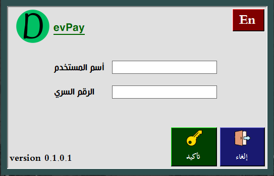

### 🏠 Home Screen  
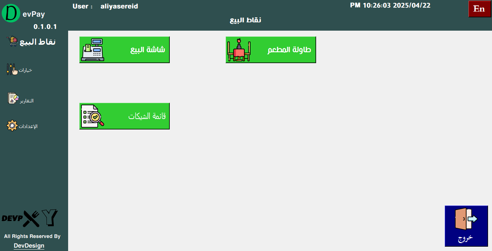

### 📊 Dashboard Overview  
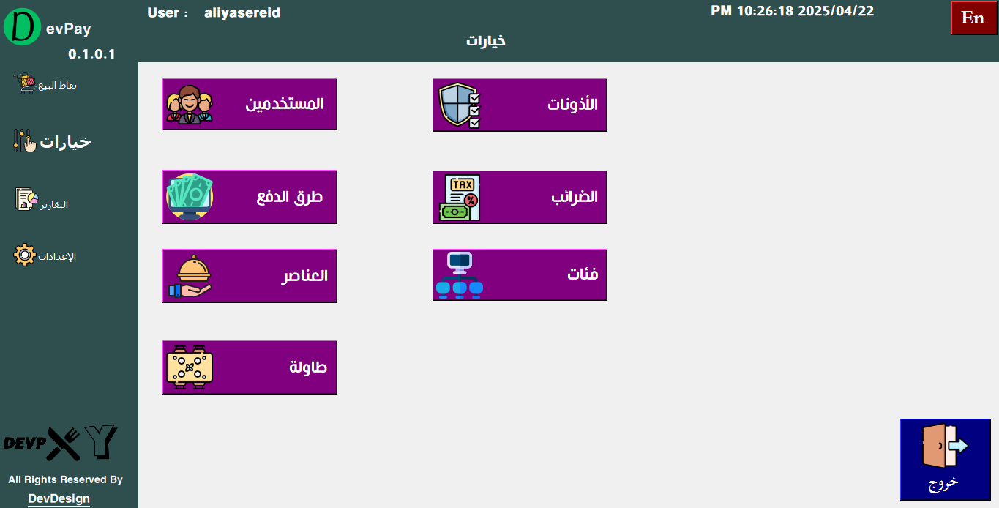

### 🧾 reports 
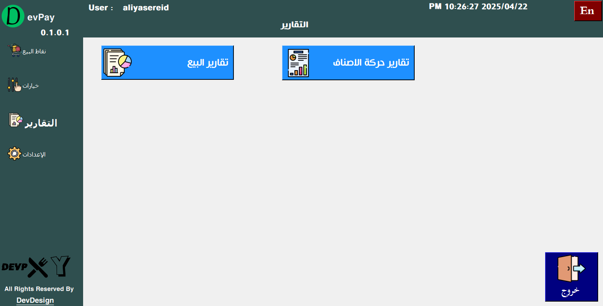

### ⚙️ Settings  
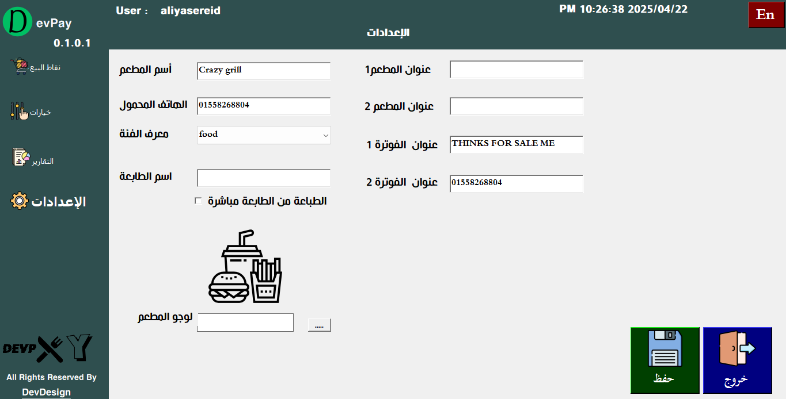

### 🧾 Point of Sale (POS) Interface  
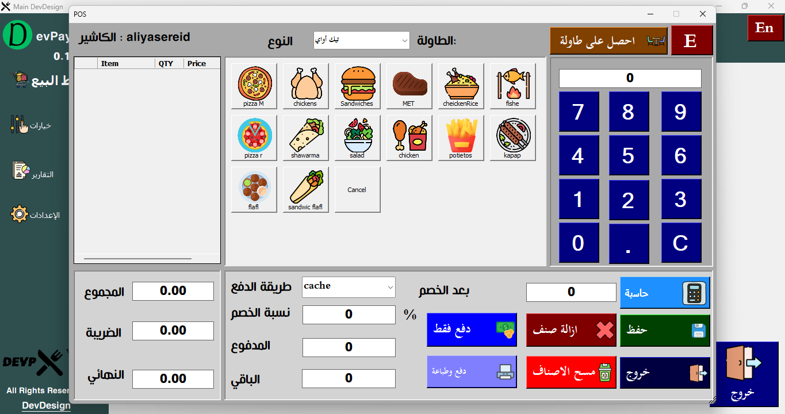

### 🍽️ Table View    
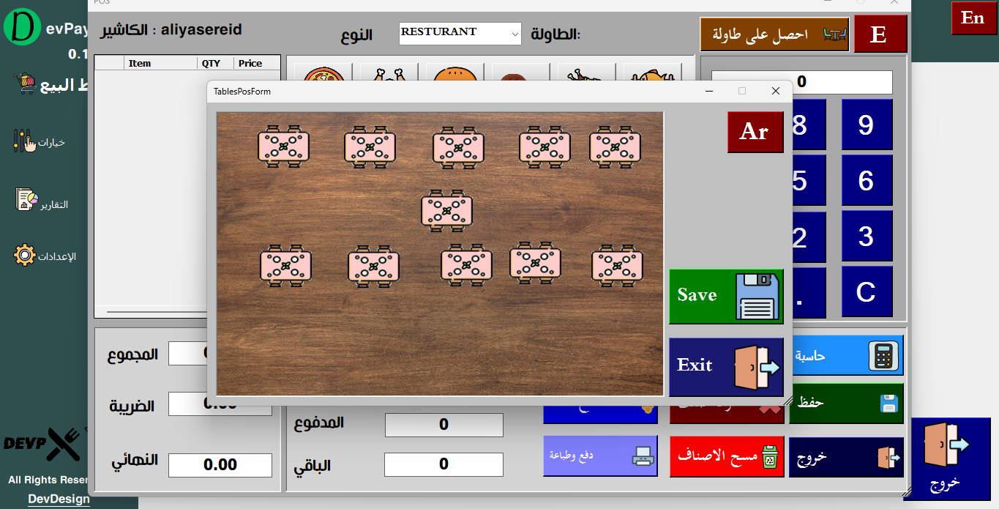

### 📊 Sales Analytics  
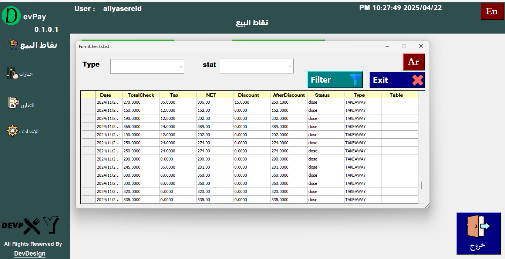

### 📊 Sales Analytics  
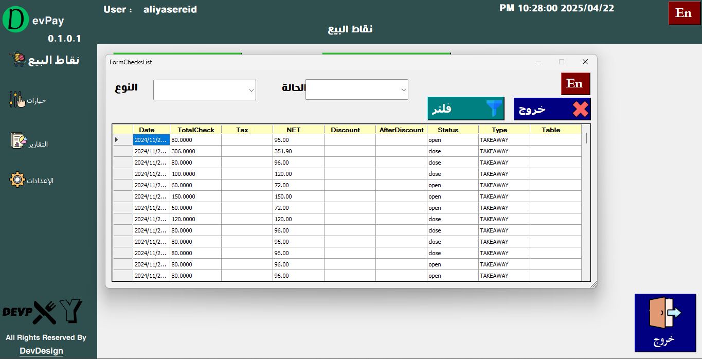

### 🧾 Bill Example 1  
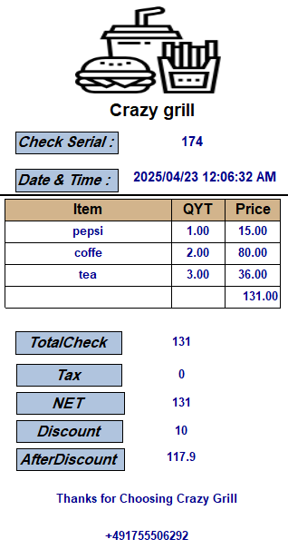

### 🧾 Bill Example 2  
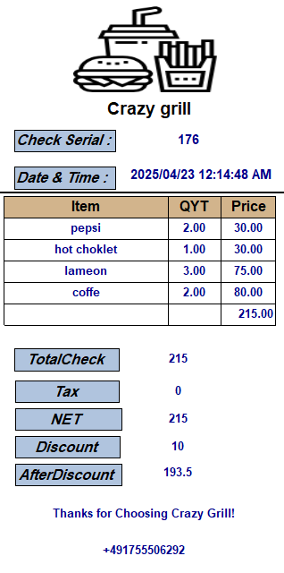
---

## 🛑 Source Code

The source code is **not available** publicly to protect the intellectual property of the developer.

---

## 📩 Request a Demo Version

To get a customized version for your business, contact us directly via WhatsApp:

> 📌 *Please include your name and business type in your message.*

---

### 👨‍💻 Developed with ❤️ using Python (for backend logic) & C# Windows Forms (UI)
